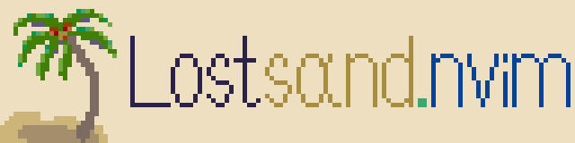

<div align="center">
    
</div>

# lostsand.nvim

A light [Neovim](https://github.com/neovim/neovim) theme written in [Lua](https://www.lua.org/). Includes extras.

## Installing

### Lazy

```lua
{
    "lostlang/lostsand.nvim",
    lazy = false,
}
```

## Basic Usage

```lua
vim.cmd([[colorscheme lostsand]])
```

## Configuration

WIP

## Overriding

WIP

## Supported modules

- [lualine](https://github.com/nvim-lualine/lualine.nvim)
- [lsp](https://github.com/neovim/nvim-lspconfig)
- [treesitter](https://github.com/nvim-treesitter/nvim-treesitter)
- [cmp](https://github.com/hrsh7th/nvim-cmp)
- [indent blankline](https://github.com/lukas-reineke/indent-blankline.nvim)
- [rainbow-delimiters](https://github.com/hiphish/rainbow-delimiters.nvim)
- [gitsigns](https://github.com/lewis6991/gitsigns.nvim)
- [todo-comments](https://github.com/folke/todo-comments.nvim)
- [neo-tree](https://github.com/nvim-neo-tree/neo-tree.nvim)
- [render-markdown](https://github.com/MeanderingProgrammer/render-markdown.nvim)

## Extras

- [GIMP](https://www.gimp.org/) ([color palette](extras/aseprite/lostsand.gpl))
- [Aseprite](https://www.aseprite.org/) ([color palette](extras/aseprite/))
- [Windows Terminal](https://apps.microsoft.com/detail/9n0dx20hk701) ([color palette](extras/windows_term/lostsand.json))
- [Zellij](https://zellij.dev/) ([color palette](extras//zellij/lostsand.kdl))
  - [zjstatus](https://github.com/dj95/zjstatus) ([color palette](extras//zellij/lostsand.kdl))
