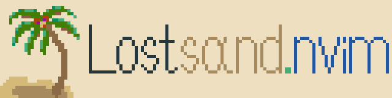

<div align="center">
    
</div>

### lostsand.nvim

A light [Neovim](https://github.com/neovim/neovim) theme written in [Lua](https://www.lua.org/). Includes extras.

### Installing

#### Lazy

```lua
{
    "lostlang/lostsand.nvim",
    lazy = false,
}
```

### Basic Usage

```lua
vim.cmd([[colorscheme lostsand]])
```

### Configuration

WIP

### Overriding

WIP

### Supported modules

- [lualine](https://github.com/nvim-lualine/lualine.nvim)
- [lsp](https://github.com/neovim/nvim-lspconfig)
- [treesitter](https://github.com/nvim-treesitter/nvim-treesitter)
- [cmp](https://github.com/hrsh7th/nvim-cmp)
- [indent blankline](https://github.com/lukas-reineke/indent-blankline.nvim)
- [rainbow delimiters](https://github.com/hiphish/rainbow-delimiters.nvim)
- [gitsigns](https://github.com/lewis6991/gitsigns.nvim)

### Extras

- [GIMP](https://www.gimp.org/) ([color palette](.extras/gimp/lostsand.gpl))
